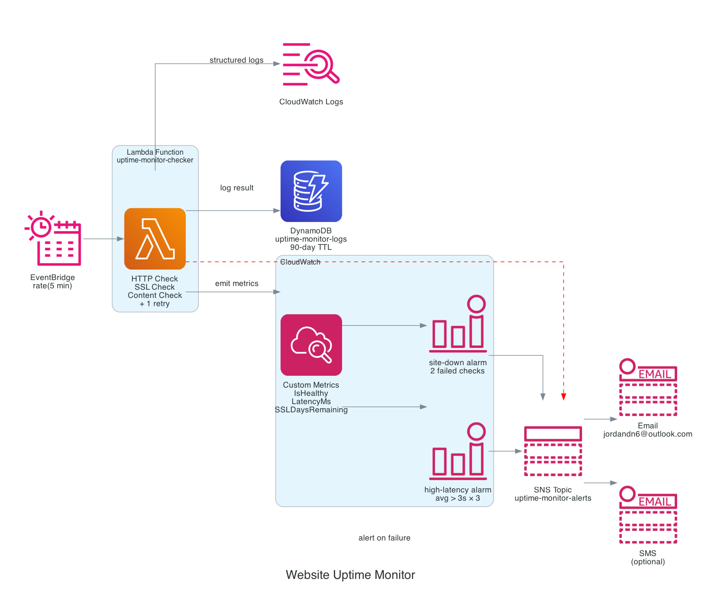

# Website Uptime Monitor

[](https://github.com/jordann6/website-uptime-monitor/actions/workflows/validate.yml)

Serverless uptime monitoring for [jordandesigns.io](https://jordandesigns.io) using AWS EventBridge, Lambda, DynamoDB, CloudWatch, and SNS.

## Architecture



EventBridge triggers a Lambda function every 5 minutes. The function performs three checks against the target URL — HTTP status, response body content, and SSL certificate expiry — with one automatic retry before alerting to suppress transient false positives. Results are logged to DynamoDB with a 90-day TTL and emitted as custom CloudWatch metrics. CloudWatch alarms fire on two consecutive failed checks or sustained high latency, publishing to an SNS topic that delivers email and SMS alerts.

## Resources

| Resource | Detail |
|---|---|
| EventBridge Rule | `rate(5 minutes)` |
| Lambda Function | Python 3.13, stdlib only |
| DynamoDB Table | Composite key (`check_id` + `timestamp`), PAY_PER_REQUEST, 90-day TTL |
| CloudWatch Metrics | `IsHealthy`, `LatencyMs`, `SSLDaysRemaining` (namespace: `UptimeMonitor`) |
| CloudWatch Alarms | `site-down` (2 consecutive failures), `high-latency` (avg > 3s × 3 checks) |
| CloudWatch Dashboard | Health, latency, SSL days, active alarms |
| SNS Topic | Email + optional SMS subscription |
| IAM Role | Least privilege: DynamoDB PutItem/Query, SNS Publish, CloudWatch PutMetricData, CloudWatch Logs |

## Checks

1. **HTTP status** — 2xx/3xx = healthy, anything else triggers alert
2. **Content check** — optional substring verified in response body (`CONTENT_CHECK` env var)
3. **SSL expiry** — warns at 30 days, alerts at 7 days remaining

## Deployment

```bash
cd backend
zip uptime_checker.zip uptime_checker.py

cd infrastructure/terraform
terraform init
terraform apply \
  -var="uptime_alert_email=you@example.com" \
  -var="uptime_alert_phone=+15551234567"
```

## Variables

| Variable | Default | Description |
|---|---|---|
| `uptime_check_url` | `https://jordandesigns.io` | URL to monitor |
| `uptime_alert_email` | required | Email for downtime alerts |
| `uptime_alert_phone` | `""` | E.164 phone for SMS alerts (optional) |
| `uptime_content_check` | `""` | Substring to verify in response body (optional) |
| `aws_region` | `us-east-1` | AWS region |

## CI/CD

GitHub Actions workflow (`.github/workflows/deploy.yml`) lints the Lambda, zips it, and runs `terraform apply` on push to `main` using OIDC for AWS authentication. Required secrets: `AWS_DEPLOY_ROLE_ARN`, `ALERT_EMAIL`, `ALERT_PHONE`.
